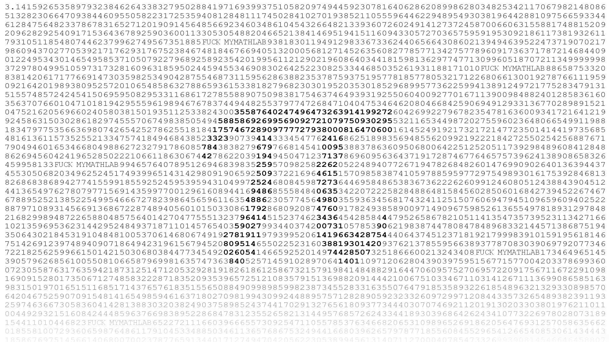

# Calculating the pi number 

## By Archimedes' method 

Archimedes' method finds an approximation of pi by determining the length of the perimeter of a polygon inscribed within a circle

###### tags: `lógica` `pi` `number pi` 
